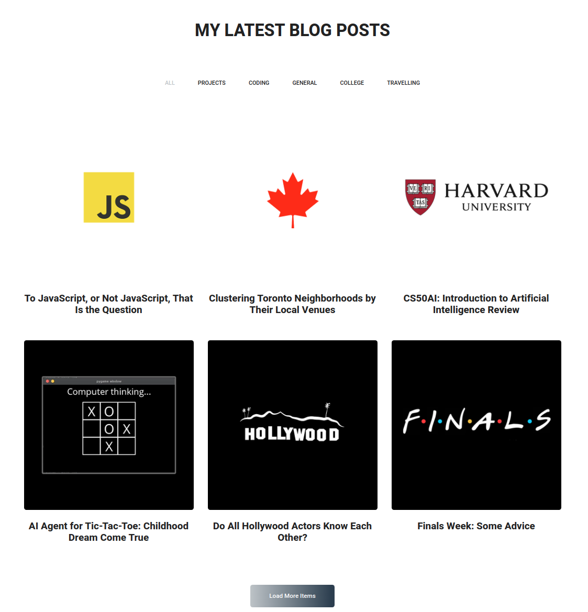
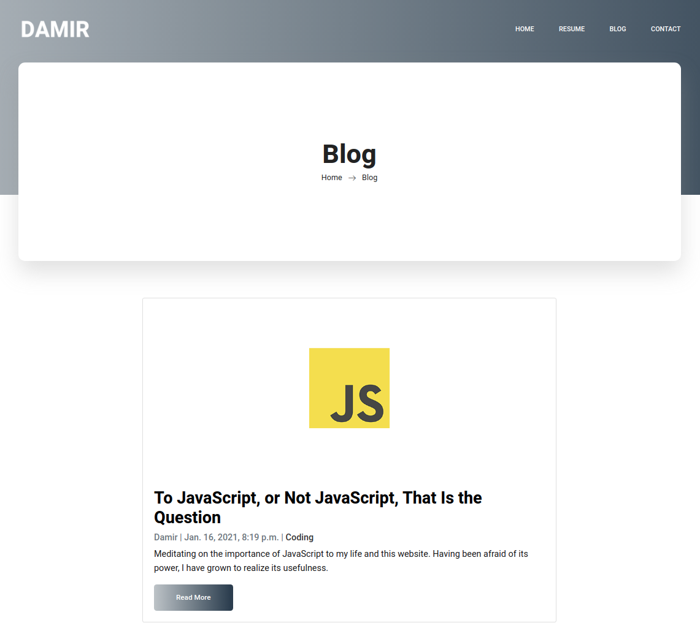
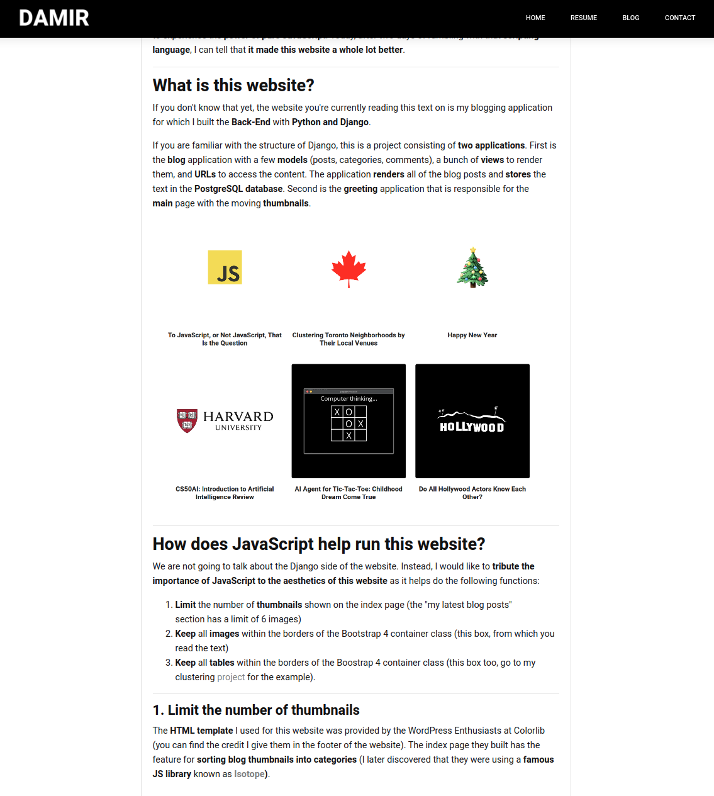
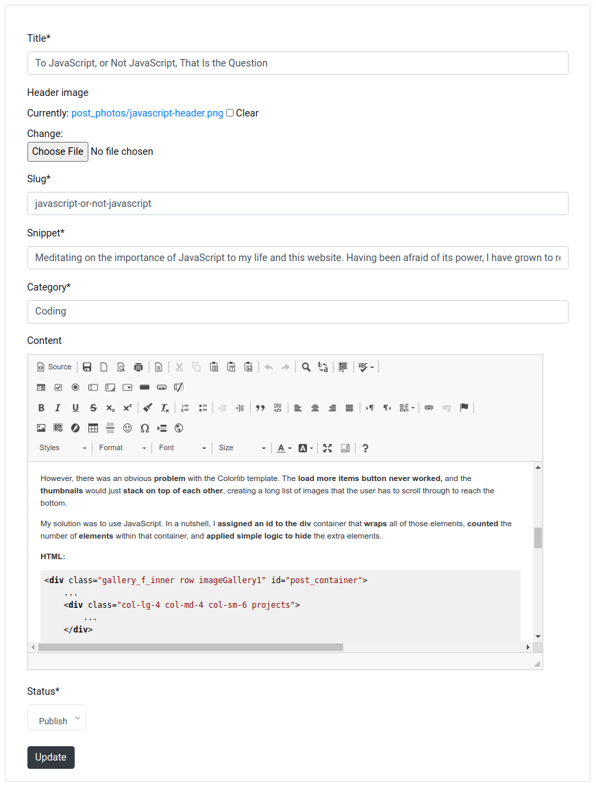

# Web-Development Projects
This a repository for my **web-development** projects.

## Web-Blogging Application with Django

The idea for the project comes from my final project for CS50x. 
A personal website with a blogging feature and interactive thumbnail system.

See Screenshots

* Some of the noticeable features of the **personal_site** project:
    * Three models in [*blog/models.py*](https://github.com/dtemir/web-development/blob/master/personal_site/blog/models.py): post, comment, and category
    * Couple of forms in [*blog/forms.py*](https://github.com/dtemir/web-development/blob/master/personal_site/blog/forms.py) for the user to leave comments, 
    make posts, and choose categories in the web interface (to make them more appealing,
    I used an extension, [crispy](https://github.com/django-crispy-forms/django-crispy-forms) 
    and to have a better text editor, I used [ckeditor](https://github.com/ckeditor/ckeditor5))
    * Bunch of views in [*blog/views.py*](https://github.com/dtemir/web-development/blob/master/personal_site/blog/views.py) that are responsible for connecting Back-End with Front-End.
    They basically feed dicts into *templates* where the data is then parsed. 
    Note that some of them are Django generic views, others are just function-based views
    * URLs for all of the views are in [*blog/urls.py*](https://github.com/dtemir/web-development/blob/master/personal_site/blog/urls.py). 
    Each view has a URL mapping, including sitemaps
    * Sitemaps for posts (django.contrib.sitemaps)
    * The [*greeting*](https://github.com/dtemir/web-development/tree/master/personal_site/greeting) application is mostly for serving statics, such as the index page, resume, and contacts.
